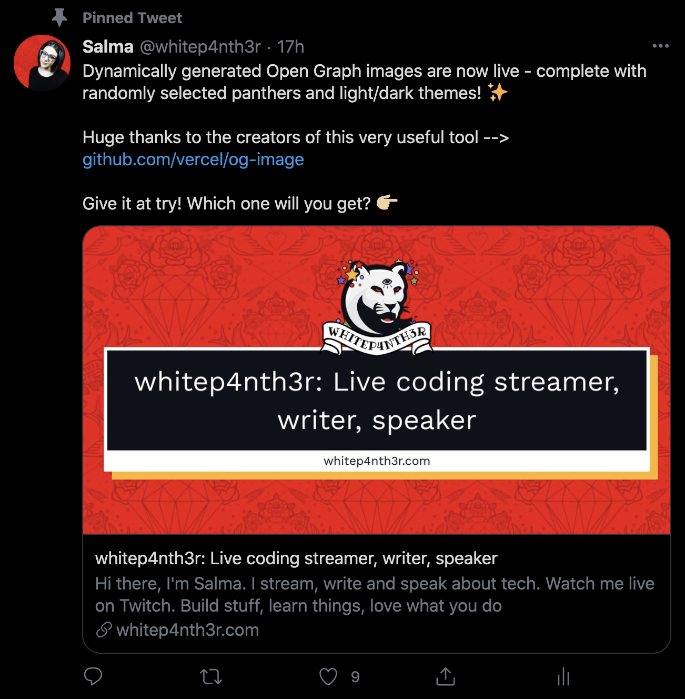

<div style="margin: auto; width: 100px">


</div>

# How to use Puppeteer to take webpage screenshots and generate dynamic Open Graph images for social sharing

It's no secret that beautiful images shared with your links on social media drive more engagement. Unfortunately, it can be really time-consuming to generate fresh images each time you publish a new blog post. The good news is, we can use a tool called Puppeteer to take screenshots of browser pages
to generate dynamic images to share on your social media accounts. Let's take a look!

## What is Puppeteer?

Puppeteer is a Node library which provides a high-level API to control headless Chrome or Chromium over the DevTools Protocol. It can also be configured to use full (non-headless) Chrome or Chromium.

Most things that you can do manually in the browser can be done using Puppeteer!

This repository contains some example code of how you can get started with Puppeteer to generate screenshots of browser pages.

[Read the Puppeteer docs here.](https://developers.google.com/web/tools/puppeteer/get-started)

## Requirements

Puppeteer uses Node to execute. If you want to host a project using Puppeteer, you'll need to use a service that can run Node functions such as [Netlify](https://www.netlify.com/), [Vercel](https://vercel.com/) or [Heroku](https://www.heroku.com/) - other options are, of course, available.

## Ready to try it out?

Fork this repository from GitHub to your local machine.

## Open your terminal and install dependencies

```bash
cd puppeteer-demo
yarn install
```

## Generate your first screenshot

Run the following command at the root of the project directory:

```bash
node demo.js https://whitep4nth3r.com
```

You'll notice that a new .png file has been created in the `screenshots` directory from the url provided.

You can also pass in multiple urls.

```bash
node demo.js https://whitep4nth3r.com https://stefanjudis.com
```

## Let's look at the code

```js
const puppeteer = require("puppeteer");

(async () => {
  // Take the urls from the command line
  var args = process.argv.slice(2);

  // loop over the urls
  for (let i = 0; i < args.length; i++) {
    // check the url has a valid protocol
    if (args[i].includes("https://")) {
      // launch a new headless browser
      const browser = await puppeteer.launch();
      const page = await browser.newPage();

      // set the viewport size
      await page.setViewport({
        width: 1920,
        height: 1080,
        deviceScaleFactor: 1,
      });

      // tell the page to visit the url
      await page.goto(args[i]);

      // take a screenshot and save it in the screenshots directory
      await page.screenshot({ path: `./screenshots/${args[i].replace("https://", "")}.png` });

      // close the browser
      await browser.close();

      // done!
      console.log(`✅ Screenshot of ${args[i]} saved!`);
    } else {
      console.error(`❌ Could not save screenshot of ${args[i]}!`);
    }
  }
})();
```

## Generating dynamic social share images for Open Graph



[Read more about the Open Graph protocol here.](https://ogp.me/)

Open Graph meta tags are used in the `<head>` of an HTML page to expose information about your web page to social media platforms and other applications that unfurl URL meta data.

This is an Open Graph meta tag that provides a url to an image that is used to represent the web page.

```html
<meta property="og:image" content="https://example.com/image.png" />
```

A great way to harness the power of Puppeteer here, is by calling out to the code that generates and saves a screenshot of a browser page at build time, so when you want to share your newly published page, a screenshot has already been created for you.

## How I generated my own dynamic Open Graph images for whitep4nth3r.com

To create dynamic Open Graph images for [my own blog posts](https://whitep4nth3r.com/blog), I forked [this repository from Vercel](https://github.com/vercel/og-image) and created [my own custom service](https://github.com/whitep4nth3r/p4nth3rblog-og-image) which I host on Vercel.

[The application is available to experiment with here](https://p4nth3rblog-og-image.vercel.app/).

The application renders an HTML page based on the title of a blog post or page, which then uses Puppeteer to screenshot the page, and cache it.

The url parameters in the request hold the key to the magic being performed here. Here's a look at the code that generates my dynamic Open Graph images, [which you can find in full here](https://github.com/whitep4nth3r/p4nth3rblog/blob/main/utils/OpenGraph.js).

```js
// Get a random light/dark theme to switch things up
function getRandomTheme() {
  const themes = ["light", "dark"];
  return themes[Math.floor(Math.random() * themes.length)];
}

// Get a random panther SVG to switch things up even more
function getRandomPanther() {
  const panthers = ["cool", "dolla", "fire", "heart", ...];
  return panthers[Math.floor(Math.random() * panthers.length)];
}

// Get the base panther image uri - it's important to use encodeURIComponent() here
// to ensure all characters of the image url are encoded
 function getBaseImageEncodedUri() {
  return encodeURIComponent(
    "https://examplebaseurl.com/dir/to/images",
  );
}

// And the magic happens here
function generateImageUrl(title) {
    return `https://url.to.the.service/${encodeURI(
      title,
    )}.png?theme=${getRandomTheme()}&md=0fontSize=80px&images=${getBaseImageEncodedUri()}${getRandomPanther()}.svg`;
}

// And this code calls the generateImageUrl function in the head of my blog pages (which use Next.js)
 <meta property="og:image" content={generateImageUrl(title)} />
```
